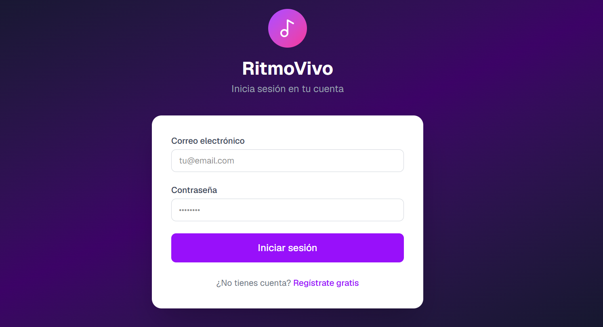
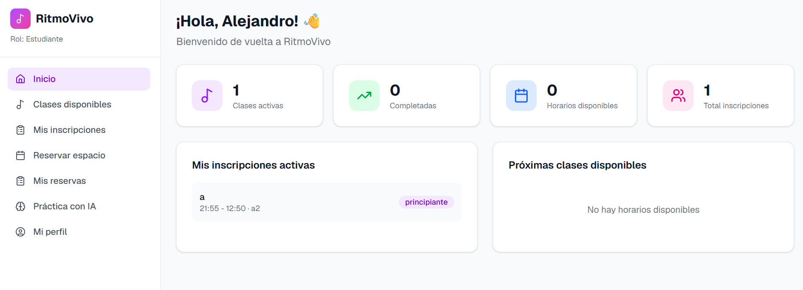

# Dance Studio — Frontend

Aplicación web para gestión de clases de baile. Construida con **Next.js + TypeScript + Tailwind CSS**.

## Tecnologías

- Next.js 14 (App Router)
- TypeScript
- Tailwind CSS
- Sonner (notificaciones)
- Lucide React (íconos)
- Socket.IO Client (chat en tiempo real)

## Instalación local

```bash
# 1. Clonar el repositorio
git clone <url-del-repo>
cd frontend

# 2. Instalar dependencias
npm install

# 3. Configurar variables de entorno
cp .env.example .env.local
# Editar con la URL de tu backend

# 4. Iniciar en desarrollo
npm run dev
```

## Variables de entorno

| Variable | Descripción |
|---|---|
| `NEXT_PUBLIC_API_URL` | URL base del backend (`http://localhost:3001/api/v1`) |

## Estructura del proyecto

```
app/
├── (auth)/         # Login, registro
├── dashboard/      # Panel estudiante
├── admin-dashboard/ # Panel administrador
├── instructor-dashboard/ # Panel instructor
└── not-found.tsx   # Página 404

components/
├── ui/             # Componentes reutilizables (Button, Card, Badge, Input)
└── layout/         # AppLayout, Sidebar, Navbar

lib/
├── api.ts          # Cliente HTTP centralizado
├── services.ts     # Servicios por recurso
├── auth-context.tsx # Contexto de autenticación

types/
└── index.ts        # Interfaces TypeScript
```

## Roles

| Rol | Acceso |
|---|---|
| `admin` | Gestión completa de clases, horarios, instructores, usuarios, inscripciones, reservas |
| `instructor` | Ver sus clases, horarios y estudiantes asignados |
| `estudiante` | Explorar clases, inscribirse, reservar, dejar feedback |

## Demo desplegado

https://ritmovivo.vercel.app/

## Screenshots



